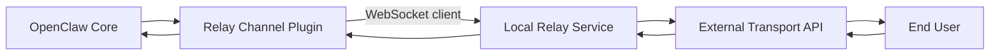

# Relay Channel Plugin Spec

## Status

- Draft
- Scope: bundled or third-party OpenClaw channel plugin
- Purpose: connect OpenClaw to a local relay over WebSocket
- Design target: Telegram-class transport UX with relay-owned transport execution

## Summary

This document specifies a universal OpenClaw channel plugin that connects to a
trusted local relay service over an account-scoped control WebSocket plus a
local file-transfer data plane.

The plugin is responsible for the OpenClaw channel contract:

- channel registration
- config, setup, and account resolution
- DM security, allowlists, pairing, and approval capability wiring
- session and conversation mapping
- thread and reply routing
- user-facing target normalization and resolution
- OpenClaw-facing outbound adapter behavior
- account runtime lifecycle and status reporting
- minimal persisted integration state

The relay is responsible for transport execution:

- maintaining the local control-plane endpoint
- exposing a local data plane for uploads and downloads
- translating plugin actions into transport-provider API calls
- converting provider updates into normalized relay events
- performing file upload and download operations

The transport goal is that, if the relay is backed by Telegram, end users do
not notice a meaningful difference compared with a direct Telegram transport.

This is a plugin and relay protocol specification. It is not a proposal for a
new OpenClaw core gateway protocol.

## Non-goals

- Defining a new generic core gateway method such as `integration.action.send`
- Changing the OpenClaw gateway wire contract
- Moving channel policy or auth into the relay by default
- Making the relay aware of OpenClaw sessions as a source of truth
- Standardizing remote or untrusted relay deployment in v1
- Replacing OpenClaw channel adapters such as `security`, `pairing`,
  `approvalCapability`, `messaging`, `status`, or `gateway`

## Why A Channel Plugin

OpenClaw channel plugins already own the surfaces this integration needs:

- config and setup
- security, pairing, and approvals
- messaging target normalization
- session conversation mapping
- outbound delivery
- reply threading
- channel actions
- account runtime lifecycle and status
- transport-adjacent state

That matches the guidance in `docs/plugins/sdk-channel-plugins.md` and the
existing bundled Telegram plugin shape in `extensions/telegram/index.ts` and
`extensions/telegram/src/channel.ts`.

This design keeps the OpenClaw-facing contract inside a normal channel plugin
while delegating transport execution to a local service.

## Architecture



## Responsibility Split

### OpenClaw Core

Core remains unchanged and continues to own:

- the shared message tool and agent loop
- generic session management
- transcript persistence
- generic `:thread:` bookkeeping
- core routing and delivery orchestration
- plugin loading and lifecycle

### Relay Channel Plugin

The plugin owns the OpenClaw channel contract:

- registration via `defineChannelPluginEntry(...)`
- channel implementation via `createChatChannelPlugin(...)`
- account and transport configuration
- DM policy, allowlists, pairing, and approval capability behavior
- transport capability discovery from the relay
- normalization of relay transport identifiers into OpenClaw-facing targets
- session and conversation mapping
- thread and reply routing
- OpenClaw outbound adapter methods
- channel status snapshots and degraded-state reporting
- account runtime lifecycle such as start, stop, reload, and reconnect
- conversion between relay events and OpenClaw channel semantics
- minimal persisted state needed for routing, replay safety, or thread bindings

The plugin must not treat the relay as the source of truth for OpenClaw session
identity.

### Local Relay

The relay owns transport execution:

- local control-plane server
- local upload and download data plane
- provider API connectivity
- outbound transport actions
- inbound transport update ingestion
- media upload and download
- provider-specific retries and rate-limit handling
- normalization of provider updates into relay protocol events

The relay does not need to know about OpenClaw sessions beyond opaque
correlation hints supplied by the plugin.

## Trust Model

V1 assumes a trusted local-only deployment:

- the plugin connects only to a loopback WebSocket endpoint
- the relay and plugin trust each other
- the WebSocket port is configurable
- no transport auth handshake is required in v1

This document intentionally skips auth. Future revisions may add:

- local shared-secret auth
- Unix domain socket support
- mTLS or signed handshake data

## Design Principles

- plugin-first, not core-first
- transport-neutral wire protocol with capability advertisement
- first-class OpenClaw channel plugin, not a transport sidecar with custom core
  affordances
- Telegram-near-full transport parity when the backing relay supports it
- OpenClaw session ownership stays in the plugin
- async lifecycle is explicit for outbound actions
- relay transport behavior is discoverable through capabilities
- unsupported features degrade by capability negotiation, not hidden failure
- files use a dedicated local data plane instead of long-lived binary transfer
  over the control WebSocket

## Telegram Precedent

The bundled Telegram plugin is the closest reference model.

Important precedents from `extensions/telegram/src/channel.ts` and related
files:

- inbound transport can have multiple modes such as polling and webhook
- session routing and conversation identity live in plugin code
- thread bindings are plugin-managed state
- outbound features include rich transport operations beyond plain text
- provider transport does not own OpenClaw session semantics

This spec keeps the same architectural split:

- OpenClaw sees a normal channel plugin
- the relay acts like a transport runtime behind that plugin

## Plugin Shape

The plugin should be implemented as a channel plugin package with the usual
layout:

```text
my-relay-channel/
  openclaw.plugin.json
  package.json
  index.ts
  setup-entry.ts
  src/channel.ts
  src/runtime.ts
  src/account-runtime.ts
  src/relay-client.ts
  src/relay-status.ts
  src/session-conversation.ts
  src/thread-bindings.ts
  src/target-resolution.ts
  src/outbound-adapter.ts
  src/protocol/control-plane.ts
  src/protocol/data-plane.ts
```

Expected registration model:

- `index.ts` uses `defineChannelPluginEntry(...)`
- `src/channel.ts` builds the channel through `createChatChannelPlugin(...)`
- `src/account-runtime.ts` manages one runtime per configured account
- `src/relay-client.ts` manages the account-scoped plugin-to-relay connection
- `src/outbound-adapter.ts` translates OpenClaw outbound calls into relay
  actions

## OpenClaw Plugin Contract Mapping

This plugin is a first-class OpenClaw channel plugin. The spec should map relay
behavior onto the canonical channel-plugin surfaces instead of inventing a
parallel abstraction.

Required OpenClaw-facing surfaces:

- `config` and `setup`: resolve accounts, inspect configuration, and validate
  relay connectivity requirements
- `gateway.startAccount(...)` and `gateway.stopAccount(...)`: start and stop
  relay-backed account runtimes
- `status`: publish account health, degraded relay state, effective provider
  identity, and capability snapshots
- `security`: DM policy, allowlists, and warnings remain plugin-owned
- `pairing`: same-chat pairing and contact approval remain plugin-owned
- `approvalCapability`: approval auth and native delivery behavior remain
  plugin-owned, even when transport delivery is delegated to the relay
- `messaging.resolveSessionConversation(...)`: canonical session grammar for
  `id`, `threadId`, `baseConversationId`, and `parentConversationCandidates`
- `messaging.resolveOutboundSessionRoute(...)`: outbound route builder after
  target resolution
- `threading`: reply mode, auto-thread selection, and transport reply behavior
- `actions.describeMessageTool(...)`: advertise shared `message` tool actions
  from negotiated capabilities
- `outbound`: translate OpenClaw sends, edits, deletes, polls, reactions, and
  typing into relay actions
- `directory` and target resolution helpers: user-facing lookup, explicit
  targets, display formatting, and fallback target resolution

The relay protocol exists to satisfy those adapters. It does not replace them.

## Capabilities

The relay protocol is capability-driven. The plugin must not assume that every
backing transport supports every feature.

### Capability Model

Capability negotiation is account-scoped and multi-layered. A single
connection-level boolean map is not sufficient for a first-class channel
plugin.

Each connected account reports:

- `coreCapabilities`: features the plugin needs for baseline chat operation
- `optionalCapabilities`: additive features that drive richer OpenClaw behavior
- `providerCapabilities`: provider-namespaced extensions for transport-specific
  affordances
- `limits`: account-scoped upload, caption, poll, and rate-limit constraints
- `targetCapabilities`: optional per-target or per-chat-type overrides

### Core Capabilities

These capabilities are expected for a useful v1 relay-backed channel:

- text messages
- media and file sends
- captions
- reply-to delivery
- thread or topic routing
- inbound message receive
- message delivery correlation

### Optional Capabilities

These capabilities are additive and must be negotiated explicitly:

- message edit
- message delete
- reactions
- typing or chat actions
- polls
- inline buttons and callback actions
- forum topic operations
- admin transport operations such as pin and unpin
- inbound edited updates
- inbound reaction updates
- file download requests
- live directory lookup
- native approval delivery helpers

### Provider-Namespace Capabilities

Telegram-shaped or provider-specific features should live under a namespaced
capability surface instead of pretending to be universal. Examples:

- `telegram.forumTopics`
- `telegram.inlineButtons`
- `telegram.callbackAnswer`
- `slack.blocks`

### Capability Rules

- capabilities are negotiated per account runtime
- the plugin must treat negotiated capabilities as runtime truth
- the plugin may advertise only actions that are supported by the current
  account and target scope
- target-specific capability overrides win over account defaults
- capability changes after reconnect or config reload must trigger an updated
  account status snapshot
- the relay must not advertise unsupported features

Capability negotiation lets a non-Telegram relay support a smaller subset while
still fitting the same plugin architecture.

## Account Model

V1 uses one relay connection per configured account.

Rationale:

- account-scoped capabilities map naturally to OpenClaw account status
- reconnect, replay cursor tracking, and degraded state stay isolated
- provider identity and auth failures remain account-local
- lifecycle methods can start and stop accounts independently

Rules:

- one configured account maps to one plugin-owned account runtime
- one account runtime owns one control-plane connection to the relay
- one relay process may serve many account runtimes
- account runtimes must not share replay cursors, idempotency keys, or
  degraded-state flags
- if a relay implementation internally multiplexes provider connections, that is
  hidden behind the per-account plugin runtime contract

## Channel Runtime Lifecycle

The plugin should describe relay behavior in normal channel runtime terms.

### Account Startup

`gateway.startAccount(...)` should:

- resolve plugin config and relay endpoint details for the target account
- create the account runtime if one does not already exist
- establish the control-plane connection
- run the account-scoped hello handshake
- fetch capability and provider identity snapshots
- restore replay cursors, subscriptions, and durable thread bindings
- publish an initial status snapshot

### Account Shutdown

`gateway.stopAccount(...)` should:

- stop new outbound admission for that account
- close the control-plane connection
- flush or abandon in-flight actions according to timeout policy
- persist replay cursors and durable plugin-owned routing state
- mark the account runtime as stopped in plugin status

### Reload And Config Change

Plugin `lifecycle` behavior should distinguish:

- no-op config changes that do not require reconnect
- account-scoped reconnects such as relay URL or transport auth changes
- full account runtime reset when provider identity changes incompatibly

Required behavior:

- status must surface `healthy`, `connecting`, `degraded`, and `stopped`
  account states
- transient relay unavailability should mark the account degraded instead of
  pretending the channel is healthy
- capability snapshots must refresh after reconnect
- plugin-owned message-tool action discovery must re-read current capabilities
  instead of caching stale results indefinitely

## WebSocket Connection Model

The plugin is always the WebSocket client.

Base assumptions:

- default endpoint is `ws://127.0.0.1:<port>`
- host must be loopback only in v1
- the plugin owns reconnect behavior
- one connection belongs to one configured account runtime
- the relay owns accepting one or more account-scoped plugin connections

Recommended plugin behavior:

- connect on account runtime startup
- back off on reconnect with bounded exponential retry
- surface degraded account status when the relay is unavailable
- restore subscriptions, capability snapshots, and replay cursors after reconnect

## Relay Wire Protocol

The relay protocol is a separate plugin-private protocol. It should be versioned
and fully typed.

The protocol has two planes:

- control plane: JSON request and event frames over WebSocket
- data plane: local HTTP or Unix socket endpoints for upload and download bytes

The control plane is authoritative for action lifecycle, capability snapshots,
replay, and provider events. The data plane is authoritative for large file
transfer.

### Frame Types

The protocol uses JSON text frames with three top-level frame families:

- `hello`
- `request`
- `event`

Optional `response` frames may be used for synchronous acknowledgements, but the
main transport lifecycle is request plus async event.

### Hello Handshake

The plugin dials the relay and sends a client hello:

```json
{
  "type": "hello",
  "protocolVersion": 1,
  "role": "openclaw-channel-plugin",
  "channelId": "relay-channel",
  "instanceId": "plugin-instance-1",
  "accountId": "default",
  "supports": {
    "asyncLifecycle": true,
    "fileDownloadRequests": true,
    "capabilityNegotiation": true,
    "accountScopedStatus": true
  },
  "requestedCapabilities": {
    "core": [
      "messageSend",
      "inboundMessages",
      "replyTo",
      "threadRouting"
    ],
    "optional": [
      "messageEdit",
      "messageDelete",
      "reactions",
      "typing",
      "polls",
      "fileDownloads"
    ]
  }
}
```

The relay responds:

```json
{
  "type": "hello",
  "protocolVersion": 1,
  "role": "local-relay",
  "relayInstanceId": "relay-1",
  "accountId": "default",
  "transport": {
    "provider": "telegram",
    "providerVersion": "bot-api-compatible"
  },
  "coreCapabilities": {
    "messageSend": true,
    "inboundMessages": true,
    "replyTo": true,
    "threadRouting": true
  },
  "optionalCapabilities": {
    "messageEdit": true,
    "messageDelete": true,
    "reactions": true,
    "typing": true,
    "polls": true,
    "pinning": true,
    "fileDownloads": true,
    "editedUpdates": true,
    "reactionUpdates": true
  },
  "providerCapabilities": {
    "telegram.inlineButtons": true,
    "telegram.forumTopics": true,
    "telegram.callbackAnswer": true
  },
  "limits": {
    "maxUploadBytes": 52428800,
    "maxCaptionBytes": 4096,
    "maxPollOptions": 10
  },
  "targetCapabilities": {
    "dm": {
      "typing": true
    },
    "group": {
      "typing": true,
      "polls": true
    },
    "topic": {
      "telegram.forumTopics": true
    }
  },
  "dataPlane": {
    "uploadBaseUrl": "http://127.0.0.1:43129/uploads",
    "downloadBaseUrl": "http://127.0.0.1:43129/downloads"
  }
}
```

Handshake rules:

- the plugin must reject incompatible protocol versions
- the hello exchange is account-scoped
- the plugin must treat capabilities and limits as runtime truth
- the relay must not advertise unsupported transport features
- the relay must include a fresh status-capability snapshot after any reconnect
- if capabilities or limits change materially during a live connection, the
  relay must emit a dedicated capability update event

### Runtime Status Events

The relay should publish account-scoped status changes that the plugin can map
into channel `status` snapshots.

Recommended events:

- `transport.account.connecting`
- `transport.account.ready`
- `transport.account.degraded`
- `transport.account.disconnected`
- `transport.capabilities.updated`

## Outbound Action Model

The plugin turns OpenClaw outbound operations into relay actions.

Base action categories:

- `message.send`
- `message.edit`
- `message.delete`
- `reaction.set`
- `typing.set`
- `poll.send`
- `message.pin`
- `message.unpin`
- `topic.create`
- `topic.edit`
- `topic.close`
- `callback.answer`
- `file.download.request`

Each action carries:

- `actionId`
- `idempotencyKey`
- `accountId`
- `targetScope`
- `transportTarget`
- `conversation`
- `thread`
- `reply`
- `payload`
- optional `openclawContext`

Example:

```json
{
  "type": "request",
  "requestType": "transport.action",
  "requestId": "req-1",
  "action": {
    "actionId": "act-1",
    "kind": "message.send",
    "idempotencyKey": "run-123:send-1",
    "accountId": "default",
    "targetScope": "topic",
    "transportTarget": {
      "channel": "telegram",
      "chatId": "-100123456"
    },
    "conversation": {
      "transportConversationId": "-100123456",
      "baseConversationId": "-100123456"
    },
    "thread": {
      "threadId": "77"
    },
    "reply": {
      "replyToTransportMessageId": "987"
    },
    "payload": {
      "text": "hello"
    },
    "openclawContext": {
      "sessionKey": "telegram:-100123456:topic:77",
      "runId": "run-123"
    }
  }
}
```

## Outbound Lifecycle

Outbound actions are async by default.

### Admission

The relay should acknowledge action admission immediately:

```json
{
  "type": "event",
  "eventType": "transport.action.accepted",
  "payload": {
    "requestId": "req-1",
    "actionId": "act-1"
  }
}
```

### Progress

Optional progress events:

- `transport.action.progress`
- `transport.action.uploading`
- `transport.action.waiting_rate_limit`

### Terminal Result

Success:

```json
{
  "type": "event",
  "eventType": "transport.action.completed",
  "payload": {
    "requestId": "req-1",
    "actionId": "act-1",
    "result": {
      "transportMessageId": "1001",
      "conversationId": "-100123456",
      "threadId": "77"
    }
  }
}
```

Failure:

```json
{
  "type": "event",
  "eventType": "transport.action.failed",
  "payload": {
    "requestId": "req-1",
    "actionId": "act-1",
    "error": {
      "code": "MESSAGE_NOT_FOUND",
      "message": "Reply target no longer exists",
      "retryable": false
    }
  }
}
```

### Delivery Semantics

V1 uses mixed semantics:

- some actions may complete fast enough to feel sync
- the protocol still models them as async
- the plugin should not assume a final result is present in the admission step

This matches real provider behavior better, especially for media, downloads,
retry windows, and rate-limited operations.

## Inbound Update Model

The relay converts provider updates into normalized transport events.

Core inbound event families:

- `transport.message.received`
- `transport.message.edited`
- `transport.message.deleted`
- `transport.reaction.updated`
- `transport.callback.received`
- `transport.poll.updated`
- `transport.topic.updated`
- `transport.delivery.receipt`
- `transport.typing.updated`
- `transport.capabilities.updated`
- `transport.account.status`

Example inbound message:

```json
{
  "type": "event",
  "eventType": "transport.message.received",
  "payload": {
    "eventId": "evt-1",
    "accountId": "default",
    "conversation": {
      "transportConversationId": "-100123456",
      "baseConversationId": "-100123456",
      "parentConversationCandidates": ["-100123456"]
    },
    "thread": {
      "threadId": "77"
    },
    "message": {
      "transportMessageId": "2002",
      "senderId": "user:555",
      "text": "ping",
      "caption": null,
      "attachments": [],
      "editedAtMs": null
    }
  }
}
```

## Conversation Identity And Session Routing

The relay does not own OpenClaw sessions.

The plugin must map relay transport identifiers into OpenClaw session grammar in
the same spirit as the Telegram plugin.

Rules:

- relay emits raw transport identifiers
- plugin normalizes those identifiers into OpenClaw conversation routing
- plugin decides the session key shape
- plugin owns `resolveSessionConversation(...)` behavior
- plugin owns `resolveOutboundSessionRoute(...)` behavior

### Canonical Session Contract

The plugin should implement session routing in terms equivalent to the canonical
OpenClaw messaging adapter contract.

`resolveSessionConversation(...)` should produce:

- `id`: the canonical session conversation id for the inbound scope
- `threadId`: optional thread or topic identifier
- `baseConversationId`: the stable parent conversation for the broader chat
- `parentConversationCandidates`: ordered from narrowest parent to broadest
  parent

Recommended relay payload fields:

- `transportConversationId`
- `baseConversationId` when the relay can identify it cheaply
- `parentConversationCandidates` when the relay can identify them cheaply
- `threadId`
- `replyToTransportMessageId`

The plugin remains the source of truth for final canonical values, even if the
relay helps precompute them.

Recommended model:

- relay provides `transportConversationId`
- relay may provide `baseConversationId`
- relay may provide ordered `parentConversationCandidates`
- relay may provide `threadId`
- plugin builds a canonical OpenClaw-facing session conversation from those
  fields

For Telegram-backed relays, the intended behavior should match Telegram plugin
semantics closely:

- DM: one base conversation per chat
- group: one base conversation per group
- topic or forum thread: topic-aware conversation and routing
- reply threading preserved when supported

### Outbound Session Route Builder

After target resolution, the plugin should compute the outbound session route in
plugin-owned code.

`resolveOutboundSessionRoute(...)` should decide:

- which canonical `target` maps to which transport conversation
- whether an explicit `threadId` is required, optional, or invalid
- whether a reply target narrows the outbound thread choice
- which `baseConversationId` should anchor future replies and follow-up actions
- whether a missing thread should fall back to the base conversation or fail

## Thread And Reply Model

Thread and reply handling is plugin-owned.

The relay should expose transport facts:

- transport conversation id
- thread or topic id
- reply-to transport message id

The plugin should decide:

- how those facts map to OpenClaw session keys
- when thread bindings should be persisted
- which thread should be used for outbound replies
- which fallback conversation should be used when a thread is missing

This follows the Telegram precedent, where thread bindings and session
conversation parsing live in plugin code, not in the provider transport.

## User-Facing Target Resolution

The spec must define how humans and agents refer to destinations, not only how
the relay addresses provider APIs.

The plugin should own:

- `normalizeTarget(...)` for canonical target strings
- `parseExplicitTarget(...)` for transport-native user input
- `inferTargetChatType(...)` for early DM versus group steering
- `directory` lookup for users, groups, channels, and topics when supported
- `formatTargetDisplay(...)` for readable CLI and UI output
- fallback `resolveTarget(...)` behavior when directory lookup misses

Recommended target flow:

1. Normalize user input into a canonical plugin-owned target string.
2. Parse explicit transport-native forms when present.
3. Use directory lookup for handles, names, and aliases when supported.
4. Infer chat type before fallback resolution when the input shape makes that
   possible.
5. Produce a final `to`, `kind`, optional display label, and optional `threadId`
   for outbound routing.

The relay should not be the first place where user-facing target strings are
interpreted. The plugin should present a stable OpenClaw-facing target grammar
even if the backing relay changes provider implementation details.

## Files And Media

The relay owns actual provider-facing media transfer.

### Control Plane And Data Plane Split

V1 should separate file bytes from the action lifecycle protocol.

- control plane: action admission, progress, completion, metadata, and errors
- data plane: actual upload and download byte transfer

Recommended v1 architecture:

- local HTTP endpoints on loopback by default
- optional future Unix domain socket transport
- short-lived upload and download tokens bound to one account and one action
- metadata and final delivery status still reported on the control plane

The control WebSocket should not be the primary transport for large file bytes.

### Outbound Media

For sends, the plugin passes one of:

- local file path
- temporary file token
- byte stream reference
- OpenClaw-generated attachment metadata

Recommended upload flow:

1. Plugin opens a transport action on the control plane.
2. Relay returns an upload plan or accepts a previously staged upload token.
3. Plugin streams bytes to the local data plane.
4. Relay emits progress and terminal events on the control plane.

### Inbound Media

For inbound messages, the relay should send:

- attachment metadata
- provider file identifiers
- file size and mime type when known
- optional preview URL or local fetch token

### Downloads

If OpenClaw needs the actual bytes, the plugin requests them explicitly via
`file.download.request` on the control plane and receives a short-lived local
download URL or fetch token for the data plane.

This avoids forcing every inbound event to carry raw file bytes.

## Buttons And Callback Actions

Telegram-class UX requires structured message actions.

The relay protocol should support:

- outbound inline buttons
- inbound callback presses
- callback acknowledgements
- callback payload correlation to the source transport message

The plugin remains responsible for mapping those actions into OpenClaw channel
action semantics.

## Reactions, Typing, Polls, And Admin Operations

These are transport features, not auth features, so they belong in the v1 spec.

The relay protocol should support:

- setting or clearing reactions
- inbound reaction updates
- starting and stopping typing indicators or chat actions
- sending polls
- receiving poll state updates
- pin and unpin style transport admin actions
- forum topic create, update, close, or reopen when supported

All such operations must be capability-gated.

## State Ownership

V1 state ownership should follow this bias:

- relay stays as stateless as practical
- plugin owns OpenClaw-facing routing state
- relay may keep transport-local caches needed for efficient execution

Plugin-owned state may include:

- thread bindings
- replay cursor tracking for relay subscriptions
- transport-to-session correlation caches
- message-id mappings required for edits, deletes, or replies

Relay-owned state may include:

- provider connection health
- upload staging state
- provider rate-limit backoff state
- provider-specific event cursors
- short-lived callback correlation windows

This mirrors the Telegram precedent, where the plugin keeps meaningful
transport-adjacent state such as thread bindings and update offsets.

## Replay, Reconnect, And Idempotency

The plugin must tolerate relay restarts and reconnects.

Required protocol features:

- monotonic event cursor or sequence number
- replay request on reconnect
- idempotency key preservation for outbound actions
- stable action IDs for correlation
- explicit timeout semantics for lost terminal action results
- deterministic ordering at least within one account connection

Recommended behavior:

- plugin stores the last acknowledged inbound cursor
- on reconnect, plugin requests replay from that cursor
- relay replays durable recent events when available
- if replay is unavailable, relay emits an explicit gap event
- duplicate terminal events for the same `actionId` must be safe to ignore
- if `accepted` was emitted but no terminal event arrives before timeout, the
  plugin should mark the action as unknown or timed out instead of assuming
  success

Gap event example:

```json
{
  "type": "event",
  "eventType": "transport.replay.gap",
  "payload": {
    "fromCursor": "104",
    "toCursor": "121",
    "reason": "relay_restart_without_durable_buffer"
  }
}
```

## Error Model

Errors are split into two classes.

### Protocol Errors

These are handshake or request-shape failures:

- unsupported protocol version
- malformed frame
- unknown request type
- missing required capability

### Transport Execution Errors

These are provider-facing failures:

- target not found
- permission denied by provider
- file too large
- message cannot be edited
- rate limit
- upstream transport timeout

Transport errors should be normalized into:

- stable `code`
- human-readable `message`
- `retryable`
- optional `retryAfterMs`

The error model should also reserve stable protocol codes for:

- `ACCOUNT_NOT_READY`
- `CAPABILITY_MISSING`
- `TARGET_SCOPE_UNSUPPORTED`
- `REPLAY_CURSOR_EXPIRED`
- `UPLOAD_TOKEN_EXPIRED`

## Local Relay Configuration

V1 config should stay minimal but must cover the full first-class channel
surface.

Suggested plugin config:

- `enabled`
- `accounts`
- `url` or `port`
- `reconnectBackoffMs`
- `maxReconnectBackoffMs`
- `requestTimeoutMs`
- `capabilityRequirements`
- DM security policy and allowlist settings
- pairing behavior and approval defaults
- optional target-directory behavior controls

The spec intentionally excludes:

- provider auth
- relay-side ownership of DM approval policy
- relay-side ownership of OpenClaw session grammar

Those belong in a future extension.

## Deferred Extension Points

The following are intentionally out of the v1 transport contract:

- transport authentication
- remote or untrusted relay deployment
- non-local data-plane transports
- richer provider-specific extensions that do not fit the generic capability
  model

The plugin should still reserve logical extension points for them so future
revisions do not require a protocol rewrite.

## V1 Decisions For Implementation

This section resolves the main design choices so an implementation agent does
not need to reopen them during v1 delivery.

### Protocol Shape

V1 chooses:

- one generic `transport.action` request envelope
- action-specific payloads under `action.kind` plus typed `payload`
- one account-scoped control connection per configured account
- local HTTP data-plane endpoints for uploads and downloads by default
- provider-specific features under namespaced capability keys

V1 does not choose:

- binary transfer over the control WebSocket as the primary file path
- one global multiplexed plugin connection for all accounts
- relay-owned session grammar or approval policy

### Durability Decisions

For v1:

- plugin replay cursors should be durable
- plugin thread bindings should be durable
- plugin message-id correlation caches should be durable when required for edit,
  delete, reply, or callback correctness
- relay replay buffers should be durable across a relay process restart when
  practical, but the protocol must still support explicit replay gaps
- idempotency-key handling must survive reconnects for a bounded retention
  window

### Failure Semantics

For v1:

- `accepted` is not success
- each `actionId` should produce at most one terminal outcome that the plugin
  treats as authoritative
- duplicate terminal events must be ignored safely
- action timeout must resolve to a local plugin-side unknown or timed-out state,
  not implicit success

## Implementation Blueprint

The following package shape is recommended for the first implementation.

```text
my-relay-channel/
  openclaw.plugin.json
  package.json
  index.ts
  setup-entry.ts
  api.ts
  runtime-api.ts
  src/
    channel.ts
    config.ts
    setup.ts
    status.ts
    security.ts
    pairing.ts
    approval.ts
    account-runtime.ts
    relay-client.ts
    relay-events.ts
    target-resolution.ts
    session-conversation.ts
    outbound-session-route.ts
    thread-bindings.ts
    message-actions.ts
    outbound-adapter.ts
    file-data-plane.ts
    persistence.ts
    protocol/
      control-plane.ts
      data-plane.ts
    *.test.ts
```

### Module Responsibilities

- `channel.ts`: assemble the `ChannelPlugin` via `createChatChannelPlugin(...)`
- `config.ts`: config schema, account resolution, and config parsing helpers
- `setup.ts`: setup adapter and configuration inspection
- `status.ts`: account snapshots, degraded-state reporting, capability display
- `security.ts`: DM policy, allowlist normalization, and warnings
- `pairing.ts`: same-chat pairing and approval-notify behavior
- `approval.ts`: `approvalCapability` implementation and native approval routing
  hooks when supported
- `account-runtime.ts`: account runtime registry and `startAccount` or
  `stopAccount` orchestration
- `relay-client.ts`: hello handshake, request dispatch, replay, reconnect, and
  event fan-out
- `relay-events.ts`: event decoding and mapping from relay events into
  OpenClaw-facing behavior
- `target-resolution.ts`: normalize, parse, resolve, infer, and format targets
- `session-conversation.ts`: canonical `resolveSessionConversation(...)`
- `outbound-session-route.ts`: canonical
  `resolveOutboundSessionRoute(...)`
- `thread-bindings.ts`: durable thread-binding manager
- `message-actions.ts`: `actions.describeMessageTool(...)` and action handlers
- `outbound-adapter.ts`: send, edit, delete, poll, reaction, and typing relay
  actions
- `file-data-plane.ts`: upload or download token handling and local HTTP helper
  logic
- `persistence.ts`: durable plugin-owned state storage
- `protocol/control-plane.ts`: zod or equivalent typed schemas for hello,
  request, event, and error frames
- `protocol/data-plane.ts`: typed upload and download token payloads plus HTTP
  contract

## Suggested Internal Types

The exact names may differ, but the implementation should converge on strongly
typed internal shapes close to these.

```ts
type RelayAccountId = string;

type RelayCapabilitySnapshot = {
  coreCapabilities: Record<string, boolean>;
  optionalCapabilities: Record<string, boolean>;
  providerCapabilities: Record<string, boolean>;
  targetCapabilities?: Record<string, Record<string, boolean>>;
  limits: {
    maxUploadBytes?: number;
    maxCaptionBytes?: number;
    maxPollOptions?: number;
  };
  transport: {
    provider: string;
    providerVersion?: string;
  };
};

type RelayAccountStatus =
  | { state: "connecting" }
  | { state: "healthy"; capabilities: RelayCapabilitySnapshot }
  | { state: "degraded"; reason: string; capabilities?: RelayCapabilitySnapshot }
  | { state: "stopped" };

type RelaySessionConversation = {
  id: string;
  threadId?: string | null;
  baseConversationId?: string | null;
  parentConversationCandidates?: string[];
};

type RelayActionRecord = {
  actionId: string;
  accountId: RelayAccountId;
  idempotencyKey: string;
  acceptedAtMs: number;
  terminalState?: "completed" | "failed" | "timed_out";
  cursor?: string | null;
};
```

The protocol schema files should validate:

- hello request and response frames
- all `transport.action` envelopes
- all inbound event families
- capability-update events
- replay request and replay-gap events
- upload-plan and download-token payloads

## Persistence Model

The plugin should persist only plugin-owned state that is needed for correctness
across restart and reconnect.

Recommended durable stores:

- replay cursor by `accountId`
- thread bindings by canonical session key
- message-id correlations by account plus conversation scope
- recent outbound action records by `actionId` and `idempotencyKey`
- last known capability snapshot by `accountId` for status continuity

Recommended non-durable or cache-like state:

- active WebSocket instance
- current reconnect timer
- in-flight upload streams
- short-lived request promise resolvers

Durability rules:

- durable keys must include `accountId`
- persisted values must use canonical plugin-owned conversation identifiers, not
  relay-internal object references
- stale action records should expire on a bounded retention policy

## Agent Execution Checklist

An implementation agent should treat the following as the canonical work plan.

### Phase 1: Plugin Skeleton

- create package manifest and entry points
- implement config schema and setup entry
- wire `defineChannelPluginEntry(...)`
- assemble `createChatChannelPlugin(...)`

### Phase 2: Core Channel Surfaces

- implement `security`
- implement `pairing`
- implement `approvalCapability`
- implement `status`
- implement `gateway.startAccount(...)` and `gateway.stopAccount(...)`

### Phase 3: Relay Runtime

- implement account runtime registry
- implement control-plane client and hello handshake
- implement status updates and degraded-state transitions
- implement reconnect and replay flow

### Phase 4: Routing

- implement target normalization and explicit target parsing
- implement directory-backed target resolution where available
- implement `resolveSessionConversation(...)`
- implement `resolveOutboundSessionRoute(...)`
- implement durable thread bindings

### Phase 5: Delivery

- implement text send
- implement inbound message receive
- implement reply and thread routing
- implement edit, delete, reaction, typing, and poll actions behind negotiated
  capabilities

### Phase 6: Files

- implement upload-plan request and local data-plane upload flow
- implement inbound attachment metadata mapping
- implement `file.download.request` plus local download-token flow

### Phase 7: Hardening

- implement idempotency retention and duplicate-terminal-event suppression
- implement cursor persistence and replay gap handling
- implement capability refresh on reconnect and config reload
- implement status diagnostics and capability display

## Test Plan

The implementation should ship with focused tests that prove the contract, not
just internal helper behavior.

### Unit Tests

- config parsing and account resolution
- capability negotiation parsing
- target normalization and explicit target parsing
- session conversation mapping
- outbound session route selection
- replay cursor persistence logic
- duplicate-terminal-event handling

### Integration-Style Plugin Tests

- `startAccount(...)` establishes one runtime per account
- reconnect transitions account state to `degraded` then back to `healthy`
- inbound text message produces the expected canonical conversation routing
- outbound text send emits the expected relay action envelope
- target-scoped capabilities correctly gate message-tool actions
- file upload path uses data-plane tokens instead of raw WS bytes

### Conformance Tests

- a relay missing required core capabilities is rejected
- a relay may omit optional capabilities without breaking baseline messaging
- topic-aware routing matches Telegram-like expectations
- replay gap event is surfaced explicitly and does not silently drop state
- approval and security surfaces remain plugin-owned even when transport is
  delegated

## Definition Of Done

The implementation is done when all of the following are true:

- the plugin loads as a normal channel plugin without core patches
- one configured account creates one isolated runtime and one relay connection
- channel `status` reflects connecting, healthy, degraded, and stopped states
- the plugin exposes working `security`, `pairing`, and `approvalCapability`
  surfaces
- canonical target resolution, session routing, and outbound route building are
  implemented
- text delivery works inbound and outbound
- file transfers use the local data plane
- capability-gated actions are advertised correctly through the shared
  `message` tool
- replay, reconnect, and idempotency semantics are covered by tests

## Recommended Implementation Order

1. Establish plugin package skeleton, channel registration, and account runtime
   manager.
2. Implement `config`, `setup`, `status`, `security`, `pairing`, and
   `approvalCapability` surfaces.
3. Implement account-scoped control-plane handshake and runtime status updates.
4. Implement text send, inbound message receive, and canonical target
   resolution.
5. Add canonical session routing, outbound session route building, and thread or
   reply mapping.
6. Add the data plane for uploads and downloads.
7. Add media, edits, deletes, reactions, typing, polls, buttons, callback
   actions, and provider-specific extensions.
8. Add replay, reconnect, cursor persistence, capability refresh, and
   idempotent retries.
9. Add future transport-auth extensions only after transport parity is stable.

## Residual Questions

- How much Telegram-specific naming, if any, is acceptable inside a supposedly
  universal relay contract?
- Should v1 directory lookup be required for conformance or only recommended for
  richer UX?
- How much relay-side precomputation of `baseConversationId` and
  `parentConversationCandidates` is worth standardizing versus leaving fully
  plugin-owned?

## Compatibility And Conformance Matrix

Minimum v1 conformance should be tracked per account and per target scope.

| Area | Required for v1 | Notes |
| --- | --- | --- |
| Account lifecycle | Yes | Start, stop, reconnect, degraded status, capability refresh |
| DM security and allowlists | Yes | Plugin-owned, not relay-owned |
| Pairing and approvals | Yes | Plugin-owned policy and delivery behavior |
| Target normalization | Yes | User-facing target grammar stays plugin-owned |
| Inbound messages | Yes | Text plus canonical conversation facts |
| Outbound text | Yes | Includes reply and thread routing when supported |
| Session routing | Yes | `id`, `threadId`, `baseConversationId`, parents |
| Replay and reconnect | Yes | Cursor restore and explicit gap handling |
| File data plane | Yes | Local upload and download architecture |
| Edits and deletes | Capability-gated | Optional but formalized |
| Reactions and typing | Capability-gated | Optional but formalized |
| Polls | Capability-gated | Optional but formalized |
| Buttons and callbacks | Capability-gated | Usually provider-specific |
| Topic operations | Capability-gated | Often Telegram-specific |

## Acceptance Criteria For V1

The design is successful if:

- OpenClaw can load the plugin as a normal channel plugin
- the plugin exposes normal OpenClaw channel surfaces for security, pairing,
  approval, messaging, status, and gateway lifecycle
- the plugin can connect to a local relay with no core protocol changes
- one configured account maps to one isolated account runtime and relay
  connection
- a Telegram-backed relay feels transport-equivalent to a direct Telegram
  channel for common user workflows
- unsupported transport features are surfaced via capabilities instead of
  implicit no-op behavior
- user-facing target resolution remains stable and plugin-owned
- file upload and download use a dedicated local data plane
- session routing, replies, and topic behavior remain stable across reconnects
